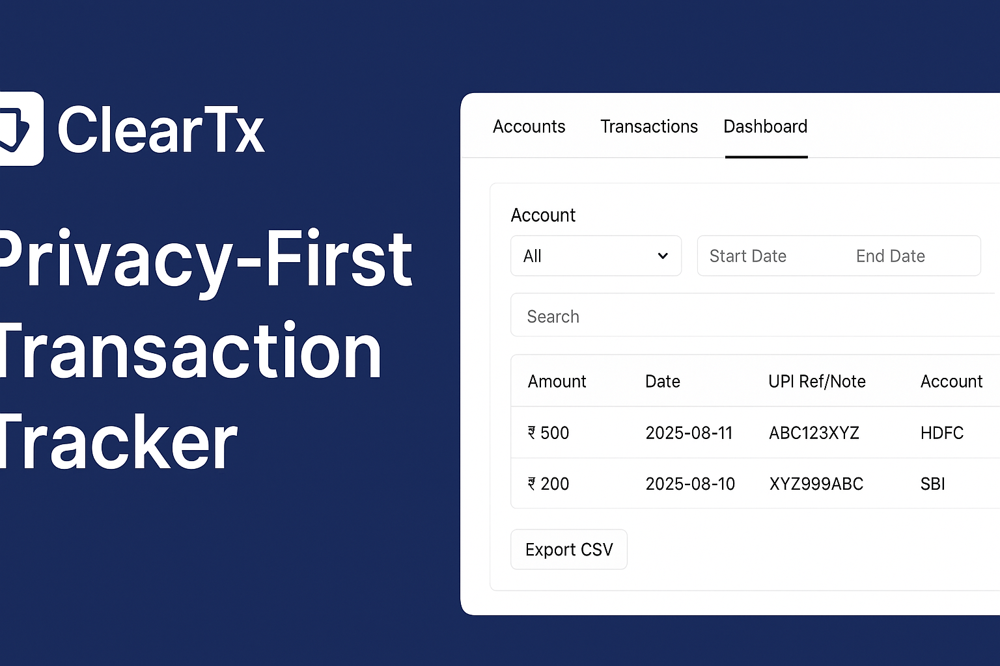

<p align="center">
  
</p>

# ClearTx 🏦

A privacy-first multi-bank transaction labeling tool

Helps you track and label UPI transactions when you have multiple bank accounts linked to one phone number — with zero server storage, 100% local privacy.

## 🚀 Features

- **Add Bank Accounts**: Save nickname & masked account number.
- **Log Transactions**: Amount, date/time, UPI ref/note, linked account.
- **Filter & Search**: By account, date range, or keyword.
- **Local-Only Storage**: No server, no tracking, all data stays in your browser.
- **CSV Export**: Download transactions for budgeting or reporting.
- **Responsive UI**: Works on desktop & mobile.

## 🖥️ Tech Stack

- **React + Vite**
- **Tailwind CSS**
- **React Router**
- **Browser LocalStorage** for persistence

## 📦 Installation & Usage

```bash
# Clone the repository
git clone https://github.com/kalel-commits/cleartx.git

# Navigate into the folder
cd cleartx

# Install dependencies
npm install

# Run in development mode
npm run dev
```

## 🌐 Deployment to GitHub Pages

```bash
# Update vite.config.ts base path
# Example: base: '/cleartx/'

# Build and deploy
npm run deploy
```

## 📊 Data Models

```js
// Account
{
  id: string,
  nickname: string,
  maskedNumber: string
}

// Transaction
{
  id: string,
  amount: number,
  date: string,
  note?: string,
  accountId: string
}
```

## 📜 License

MIT License © 2025 Ajay
